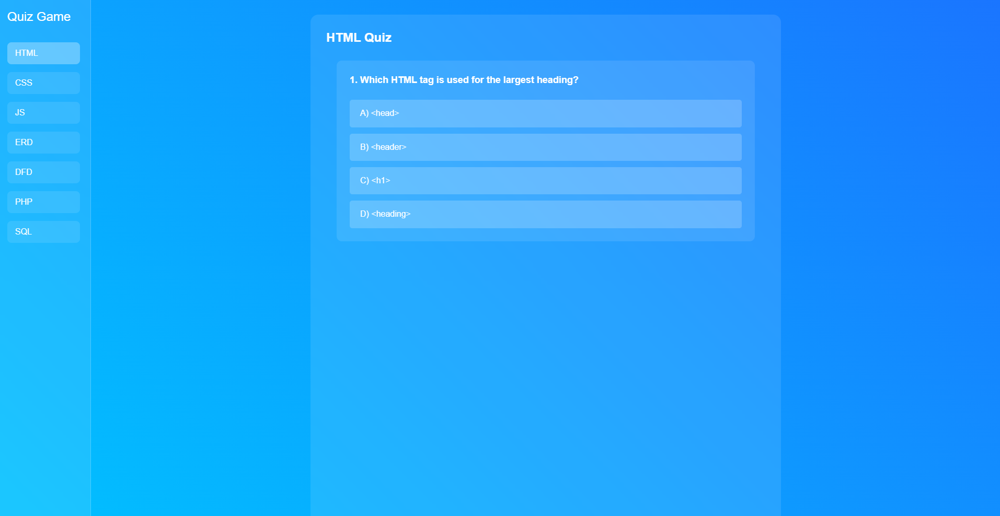

# Quiz Game 📚
A dynamic web-based quiz application featuring multiple topics with instant feedback and scoring.


## Features ✨
* **Multiple Quiz Topics** - HTML, CSS, JavaScript, ERD, DFD, PHP, and SQL
* **Real-time Feedback** - Instant visual and audio feedback for answers
* **Dynamic Scoring** - Automatic score calculation and display
* **Responsive Design** - Seamless experience across all devices
* **Interactive UI** - Clean and intuitive user interface
* **Sound Effects** - Engaging audio feedback for correct/incorrect answers

## Technologies Used 🛠️
* HTML5
* CSS3
* JavaScript (ES6+)

## Project Structure 📁
```
quiz-game/
├── index.html
├── assets/
│   ├── css/
│   │   ├── style.css
│   │   └── quiz.css
│   ├── js/
│   │   ├── html.js
│   │   ├── css.js
│   │   ├── js.js
│   │   ├── erd.js
│   │   ├── dfd.js
│   │   ├── php.js
│   │   ├── sql.js
│   │   ├── quiz.js
│   │   └── script.js
│   ├── sound/
│   │   ├── Correct.wav
│   │   └── Wrong.wav
│   └── img/
└── README.md
```

## Getting Started 🚀
1. Clone the repository:
   ```bash
   git clone https://github.com/your-username/quiz-game.git
   ```
2. Navigate to the project directory:
   ```bash
   cd quiz-game
   ```
3. Open index.html in your browser or use a local server:
   ```bash
   php -S localhost:8000
   ```
4. Access the application:
   ```
   http://localhost:8000
   ```

## Features Details 💡
### Quiz Topics
* **HTML** - Web markup fundamentals
* **CSS** - Styling and layout concepts
* **JavaScript** - Programming and web interactivity
* **ERD** - Entity-Relationship Diagrams
* **DFD** - Data Flow Diagrams
* **PHP** - Server-side scripting
* **SQL** - Database queries and management

### Quiz Interface
* Topic selection sidebar
* Question display with multiple choice options
* Immediate feedback with sound effects
* Score tracking and final results display

### Feedback System
* Visual feedback for correct/incorrect answers
* Audio cues for enhanced user experience
* Final score display with total questions attempted

## Customization 🎨
### Adding New Questions
Add questions to the respective topic file (e.g., html.js):
```javascript
const htmlQuestions = [
    {
        question: "Your question here?",
        options: [
            { text: "A) Option 1", correct: false },
            { text: "B) Option 2", correct: true },
            { text: "C) Option 3", correct: false },
            { text: "D) Option 4", correct: false }
        ]
    }
];
```

### Styling
Modify the CSS variables in style.css:
```css
:root {
    --primary-color: #00c3ff;
    --secondary-color: #1a75ff;
    /* Add custom variables */
}
```

## Responsive Design 📱
* Desktop optimized (>1024px)
* Tablet friendly (768px - 1024px)
* Mobile responsive (<768px)

## Contributing 🤝
1. Fork the repository
2. Create your feature branch (`git checkout -b feature/NewFeature`)
3. Commit your changes (`git commit -m 'Add some NewFeature'`)
4. Push to the branch (`git push origin feature/NewFeature`)
5. Open a Pull Request

## License 📝
This project is open-source and available under the MIT License.

## Support 🙋‍♂️
For support, please open an issue in the repository.